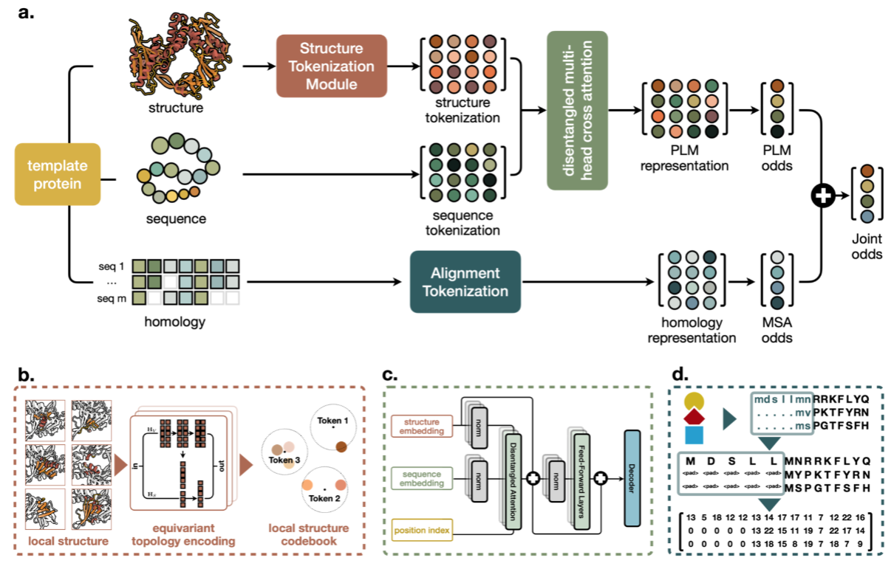
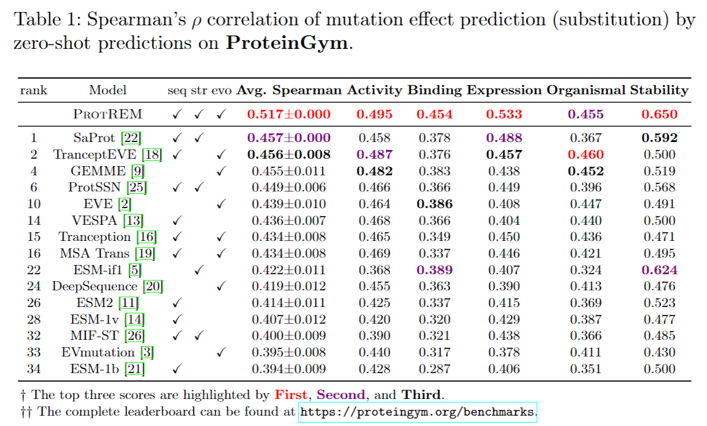

# Retrieval-Enhanced Mutation Mastery: Augmenting Zero-Shot Prediction of Protein Language Model

## 🚀 Introduction (ProREM)



## 📑 Results

### News

- [2024.10.21] 

### Downloads

- ProteinGym a2m homology sequences (EVCouplings): https://huggingface.co/datasets/tyang816/ProREM/blob/main/aa_seq_aln_a2m.tar.gz. The original a2m files are downloaded at [ProteinGym](https://github.com/OATML-Markslab/ProteinGym).
- ProteinGym a3m homology sequences (ColabFold): https://huggingface.co/datasets/tyang816/ProREM/blob/main/aa_seq_aln_a3m.tar.gz
- Uniref 100 database: https://ftp.uniprot.org/pub/databases/uniprot/uniref/uniref100/uniref100.fasta.gz

### Paper Results



## 🛫 Requirement

### Conda Enviroment

Please make sure you have installed **[Anaconda3](https://www.anaconda.com/download)** or **[Miniconda3](https://docs.conda.io/projects/miniconda/en/latest/)**.

```
conda env create -f environment.yml
conda activate prorem

# We need HMMER and EVCouplings for MSA
# pip install hmmer
# pip install https://github.com/debbiemarkslab/EVcouplings/archive/develop.zip
```

### Other Requirement

Install plmc and change the path in `src/single_config_monomer.txt`
```shell
git clone https://github.com/debbiemarkslab/plmc.git
cd plmc
make all-openmp
```

### Hardware

- For direct use of inference, we recommend at least 10G of graphics memory, such as RTX 3080
- For searching homology sequences, 8 cores cpu.

## 🧬 Zero-shot Prediction for Mutants

### Evaluation on ProteinGym

#### Prepare for the processed data
```shell
cd data/proteingym_v1
wget https://huggingface.co/datasets/tyang816/ProREM/blob/main/aa_seq_aln_a2m.tar.gz
# unzip homology files
tar -xzf aa_seq_aln_a2m.tar.gz
# unzip fasta sequence files
tar -xzf aa_seq.tar.gz
# unzip pdb structure files
tar -xzf pdbs.tar.gz
# unzip structure sequence files
tar -xzf struc_seq.tar.gz
# unzip DMS substitution csv files
tar -xzf substitutions.tar.gz
```

#### Start inference
```shell
protein_dir=proteingym_v1
python compute_fitness.py \
    --base_dir data/$protein_dir \
    --out_scores_dir result/$protein_dir
```

### Your own dataset

#### What you need at least
```shell
data/<your_protein_dir_name>
|——aa_seq # amino acid sequences
|——|——protein1.fasta
|——|——protein2.fasta
|——aa_seq_aln_a2m # homology sequences of EVCouplings
|——|——protein1.a2m
|——|——protein2.a2m
|——pdbs # structures
|——|——protein1.pdb
|——|——protein2.pdb
|——struc_seq # structure sequences
|——|——protein1.fasta
|——|——protein2.fasta
|——substitutions # mutant files
|——|——protein1.csv
|——|——protein2.csv
```

#### Search homology sequences by JackHmmer
```shell
# step 1: search homology sequences
# your protein name, eg. fluorescent_protein
protein_dir=<your_protein_dir_name>
# your protein path, eg. data/fluorescent_protein/aa_seq/GFP.fasta
query_protein_name=<your_protein_name>
protein_path=data/$protein_dir/aa_seq/$query_protein_name.fasta
# your uniprot dataset path
database=<your_path>/uniref100.fasta
evcouplings \
    -P output/$protein_dir/$query_protein_name \
    -p $query_protein_name \
    -s $protein_path \
    -d $database \
    -b "0.1, 0.2, 0.3, 0.4, 0.5, 0.6, 0.7, 0.8, 0.9" \
    -n 5 src/single_config_monomer.txt
# ⚠ 👆 Repeat the searching process until all your proteins are done

# step 2: select a2m file
protein_dir=<your_protein_dir_name>
python src/data/select_msa.py \
    --input_dir output/$protein_dir \
    --output_dir data/$protein_dir
```

#### Get pdb files for your protein
You can use [AlphaFold3 server](https://alphafoldserver.com/), [AlphaFold database](https://alphafold.ebi.ac.uk/download), [ESMFold](https://huggingface.co/facebook/esmfold_v1) and other tools to obtain structures.

⚠ **For wet-lab experiments, please try to get high quality structures as possible as you can.**

#### Get structure sequences for PLM
```shell
protein_dir=<your_protein_dir_name>
python src/data/get_struc_seq.py \
    --pdb_dir data/$protein_dir/pdbs \
    --out_dir data/$protein_dir/struc_seq
```

#### Start inference
```shell
protein_dir=<your_protein_dir_name>
python compute_fitness.py \
    --base_dir data/$protein_dir \
    --out_scores_dir result/$protein_dir
```

### Other Directed Evolution Tools

You can use [ProtSSN (eLife 2024)](https://github.com/tyang816/ProtSSN) or [ProSST (NeurIPS 2024)](https://github.com/ai4protein/ProSST).

### Questions

#### Q: How to quickly convert the input format of ProREM to ProtSSN or ProSST?

A: For the conversion between ProREM and ProtSSN input formats, you can refer to `script/data_format_convert.sh`. For the ProSST, jsut change the alpha to 0.

```shell
protein_dir=<your_protein_dir_name>
python compute_fitness.py \
    --base_dir data/$protein_dir \
    --out_scores_dir result/$protein_dir \
    --alpha 0 \
    --model_out_name ProSST-2048
```

#### Q: What is the difference between ProtSSN, ProSST and ProREM?

A: ProtSSN uses modeling at the amino acid coordinate level, ProSST models on the local structure, and ProREM explicitly introduces MSA information. They each have their own advantages and disadvantages in real experimental evaluation.

## 🙌 Citation

Please cite our work if you have used our code or data.

```
@article{tan2024prorem,
  title={Retrieval-Enhanced Mutation Mastery: Augmenting Zero-Shot Prediction of Protein Language Model},
  author={Tan, Yang and Wang, Ruilin and Wu, Banghao and Hong, Liang and Zhou, Bingxin},
  journal={arXiv:2410.21127},
  year={2024}
}
```