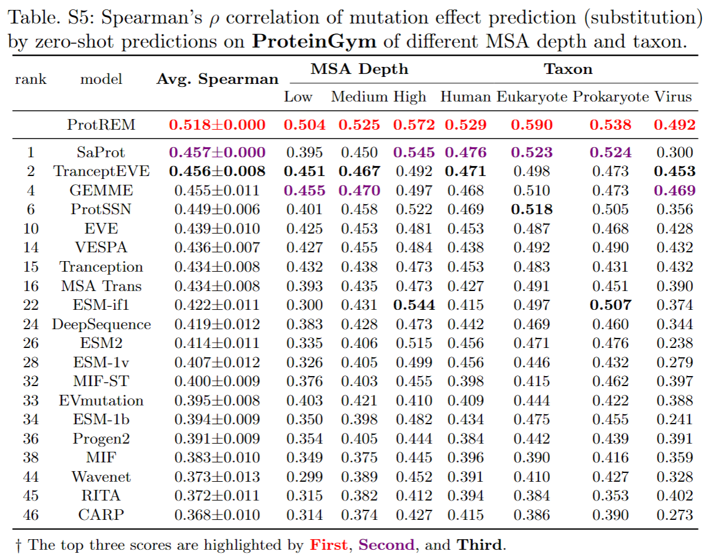

# Retrieval-Enhanced Mutation Mastery: Augmenting Zero-Shot Prediction of Protein Language Model

## 🚀 Introduction (ProtREM)


## 📑 Results




### News

- [2024.xx.xx]

## 🛫 Requirement

### Conda Enviroment

Please make sure you have installed **[Anaconda3](https://www.anaconda.com/download)** or **[Miniconda3](https://docs.conda.io/projects/miniconda/en/latest/)**.

```
conda env create -f environment.yaml
conda activate protrem

# We need HMMER and EVCouplings for MSA
# conda install -c biocore hmmer
# pip install https://github.com/debbiemarkslab/EVcouplings/archive/develop.zip
```

### Other Requirement

Install plmc
```shell
git clone https://github.com/debbiemarkslab/plmc.git
cd plmc
make all-openmp
```

## 🙌 Citation

Please cite our work if you have used our code or data.

```

```